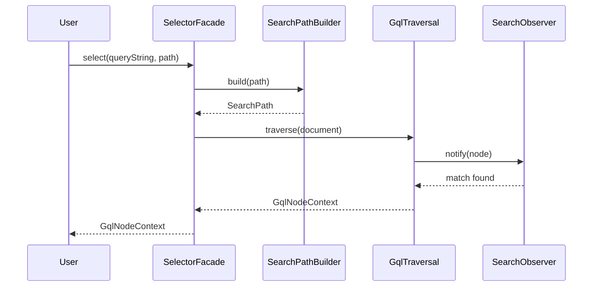

# gqlXPath - GraphQL Path Selection Engine

[](https://openjdk.java.net/)
[](LICENSE)
[](https://github.com/Gqlex/gqlex-path-selection-java/actions)

## 📋 Table of Contents

- [🚀 Overview](#-overview)
- [⚡ Quick Start](#-quick-start)
- [🎯 Core Features](#-core-features)
- [📚 Syntax Reference](#-syntax-reference)
- [🔧 Usage Examples](#-usage-examples)
- [🏗️ Architecture](#️-architecture)
- [📖 API Reference](#-api-reference)
- [🎯 Best Practices](#-best-practices)
- [🆘 Support](#-support)

## 🚀 Overview

**gqlXPath** is the core path selection engine in the gqlex library, providing **XPath-style navigation** for GraphQL documents. It enables precise selection and navigation through GraphQL nodes using path expressions, making it easy to locate specific elements in complex GraphQL queries, mutations, and fragments.

### Key Benefits:
- ✅ **XPath-like Syntax** - Familiar path-based navigation
- ✅ **Generic & Agnostic** - Works with any GraphQL schema
- ✅ **Precise Selection** - Target specific nodes with exact paths
- ✅ **Range Support** - Select multiple nodes with range expressions
- ✅ **Type-Aware** - Select by node type, name, or alias
- ✅ **Performance Optimized** - Efficient traversal and selection

## ⚡ Quick Start

```java
import com.intuit.gqlex.common.GqlNodeContext;
import com.intuit.gqlex.gqlxpath.selector.SelectorFacade;

// Initialize the selector
SelectorFacade selectorFacade = new SelectorFacade();

// Select specific nodes using gqlXPath
GqlNodeContext hero = selectorFacade.select(queryString, "//query/hero/name");
GqlNodeContext friends = selectorFacade.select(queryString, "//query/hero/friends");
GqlNodeContext episode = selectorFacade.select(queryString, "//query/hero/episode[type=arg]");
```

## 🎯 Core Features

| Feature | Description | Example |
|---------|-------------|---------|
| **🔍 Path Selection** | Navigate using slash-separated paths | `//query/hero/name` |
| **📊 Range Selection** | Select multiple nodes with ranges | `{0:2}//query/hero/friends` |
| **🎯 Type Filtering** | Filter by node type | `//query/hero/episode[type=arg]` |
| **🏷️ Name Filtering** | Filter by node name | `//query[name=hero]/hero` |
| **📝 Alias Support** | Select by field aliases | `//query/hero[alias=mainHero]` |
| **🔄 Wildcard Support** | Use relative paths with `...` | `//query/hero/.../name` |

## 📚 Syntax Reference

### Path Expressions

| Expression | Description | Example |
|------------|-------------|---------|
| `//` | Select all nodes from root | `//query/hero` |
| `/` | Select first node from root | `/query/hero` |
| `{x:y}/` | Select nodes in range x to y | `{0:2}//query/hero/friends` |
| `{:y}//` | Select from first to y | `{:3}//query/hero/friends` |
| `{x:}/` | Select from x to end | `{2:}//query/hero/friends` |
| `...` | Relative path wildcard | `//query/hero/.../name` |

### Element Filters

| Filter | Description | Example |
|--------|-------------|---------|
| `type=` | Filter by node type | `[type=arg]` |
| `name=` | Filter by node name | `[name=hero]` |
| `alias=` | Filter by field alias | `[alias=mainHero]` |

### Node Types

| Type | Abbreviation | Description |
|------|--------------|-------------|
| `DOCUMENT` | `doc` | GraphQL document root |
| `OPERATION_DEFINITION` | `query` | Query operation |
| `MUTATION_DEFINITION` | `mutation` | Mutation operation |
| `FIELD` | `fld` | GraphQL field |
| `ARGUMENT` | `arg` | Field argument |
| `DIRECTIVE` | `direc` | GraphQL directive |
| `FRAGMENT_DEFINITION` | `frag` | Fragment definition |
| `INLINE_FRAGMENT` | `infrag` | Inline fragment |
| `VARIABLE_DEFINITION` | `var` | Variable definition |

## 🔧 Usage Examples

### 1. Basic Field Selection

```java
// Select hero name field
GqlNodeContext heroName = selectorFacade.select(queryString, "//query/hero/name");

// Select hero friends
GqlNodeContext friends = selectorFacade.select(queryString, "//query/hero/friends");

// Select nested fields
GqlNodeContext friendName = selectorFacade.select(queryString, "//query/hero/friends/name");
```

### 2. Argument Selection

```java
// Select episode argument
GqlNodeContext episodeArg = selectorFacade.select(queryString, "//query/hero/episode[type=arg]");

// Select limit argument
GqlNodeContext limitArg = selectorFacade.select(queryString, "//query/hero/limit[type=arg]");
```

### 3. Variable Selection

```java
// Select episode variable
GqlNodeContext episodeVar = selectorFacade.select(queryString, "//query/episode[type=var]");

// Select withFriends variable
GqlNodeContext withFriendsVar = selectorFacade.select(queryString, "//query/withFriends[type=var]");
```

### 4. Directive Selection

```java
// Select include directive
GqlNodeContext includeDirective = selectorFacade.select(queryString, "//query/hero/friends/include[type=direc]");

// Select directive argument
GqlNodeContext directiveArg = selectorFacade.select(queryString, "//query/hero/friends/include[type=direc]/if[type=arg]");
```

### 5. Fragment Selection

```java
// Select fragment definition
GqlNodeContext fragment = selectorFacade.select(queryString, "//comparisonFields[type=frag]");

// Select inline fragment
GqlNodeContext inlineFragment = selectorFacade.select(queryString, "//query/hero/Droid[type=infrag]");
```

### 6. Range Selection

```java
// Select first 3 friends
GqlNodeContext firstThreeFriends = selectorFacade.select(queryString, "{0:2}//query/hero/friends");

// Select friends from index 2 to end
GqlNodeContext remainingFriends = selectorFacade.select(queryString, "{2:}//query/hero/friends");
```

### 7. Wildcard Selection

```java
// Select any name field under hero
GqlNodeContext anyName = selectorFacade.select(queryString, "//query/hero/.../name");

// Select any field with wildcard path
GqlNodeContext anyField = selectorFacade.select(queryString, "//query/.../name");
```

### 8. Complex Queries

```java
// Select hero with specific name
GqlNodeContext specificHero = selectorFacade.select(queryString, "//query[name=hero]/hero");

// Select hero with alias
GqlNodeContext aliasedHero = selectorFacade.select(queryString, "//query/hero[alias=mainHero]");

// Select nested fields with conditions
GqlNodeContext complexSelection = selectorFacade.select(queryString, "//query/hero/friends/.../name[type=fld]");
```

## 🏗️ Architecture



## 📖 API Reference

### SelectorFacade

```java
public class SelectorFacade {
    // Select using string path
    public GqlNodeContext select(String queryString, String path)
    
    // Select using SyntaxPath object
    public GqlNodeContext select(String queryString, SyntaxPath syntaxPath)
}
```

### SyntaxBuilder

```java
public class SyntaxBuilder {
    // Build path programmatically
    public SyntaxBuilder appendQuery()
    public SyntaxBuilder appendField(String fieldName)
    public SyntaxBuilder appendArgument(String argumentName)
    public SyntaxBuilder appendDirective(String directiveName)
    public SyntaxPath build()
}
```

### GqlNodeContext

```java
public class GqlNodeContext {
    // Get the selected node
    public Node getNode()
    
    // Get node path
    public String getPath()
    
    // Get node type
    public DocumentElementType getType()
    
    // Get parent context
    public GqlNodeContext getParent()
}
```

## 🎯 Best Practices

### 1. Path Design

```java
// ✅ Good: Use descriptive paths
"//query/hero/name"
"//query/hero/friends/name"

// ❌ Avoid: Generic paths
"//query/field1/field2"
"//query/a/b"
```

### 2. Type Filtering

```java
// ✅ Good: Use type filters for precision
"//query/hero/episode[type=arg]"
"//query/hero/friends/include[type=direc]"

// ❌ Avoid: Ambiguous selections
"//query/hero/episode"
"//query/hero/friends/include"
```

### 3. Range Selection

```java
// ✅ Good: Use ranges for multiple selections
"{0:2}//query/hero/friends"  // First 3 friends
"{2:}//query/hero/friends"   // Friends from index 2

// ❌ Avoid: Selecting all when you need specific ones
"//query/hero/friends"  // All friends when you only need some
```

### 4. Error Handling

```java
try {
    GqlNodeContext result = selectorFacade.select(queryString, path);
    if (result != null) {
        // Process the selected node
        Node node = result.getNode();
        // ... handle the node
    } else {
        // Handle case where no node was found
        System.out.println("No node found for path: " + path);
    }
} catch (Exception e) {
    // Handle parsing or selection errors
    System.err.println("Error selecting node: " + e.getMessage());
}
```

### 5. Performance Optimization

```java
// ✅ Good: Reuse SelectorFacade instance
SelectorFacade selectorFacade = new SelectorFacade();

// Multiple selections with same instance
GqlNodeContext hero = selectorFacade.select(queryString, "//query/hero");
GqlNodeContext friends = selectorFacade.select(queryString, "//query/hero/friends");

// ❌ Avoid: Creating new instances for each selection
GqlNodeContext hero = new SelectorFacade().select(queryString, "//query/hero");
GqlNodeContext friends = new SelectorFacade().select(queryString, "//query/hero/friends");
```

## 🆘 Support

- **📖 Documentation**: [Main README](../../../../README.md)
- **🐛 Issues**: [GitHub Issues](https://github.com/Gqlex/gqlex-path-selection-java/issues)
- **💬 Discussions**: [GitHub Discussions](https://github.com/Gqlex/gqlex-path-selection-java/discussions)
- **📧 Contact**: [Project Maintainers](https://github.com/Gqlex/gqlex-path-selection-java/blob/main/README.md#support)

---

**gqlXPath** provides powerful, XPath-style navigation for GraphQL documents, making it easy to locate and work with specific nodes in complex GraphQL structures. 🚀

