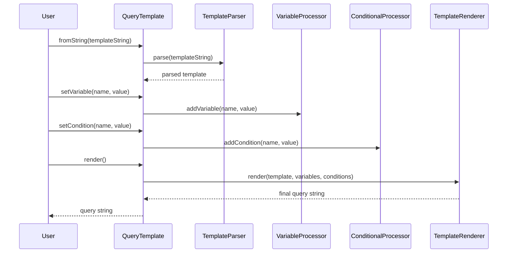

# GraphQL Query Templating System

[](https://openjdk.java.net/)
[](LICENSE)
[](https://github.com/Gqlex/gqlex-path-selection-java/actions)

## 📋 Table of Contents

- [🚀 Overview](#-overview)
- [⚡ Quick Start](#-quick-start)
- [🎯 Core Features](#-core-features)
- [🔧 Usage Examples](#-usage-examples)
- [🏗️ Architecture](#️-architecture)
- [📖 API Reference](#-api-reference)
- [🎯 Best Practices](#-best-practices)
- [🆘 Support](#-support)

## 🚀 Overview

The **GraphQL Query Templating System** is a powerful component that enables **dynamic, reusable GraphQL queries** with variable substitution and conditional blocks. It provides a **generic and agnostic** approach to creating flexible GraphQL queries that work with any schema without hardcoded assumptions.

### Key Benefits:
- ✅ **Generic & Agnostic** - Works with any GraphQL query, mutation, or subscription
- ✅ **Variable Substitution** - Replace placeholders with runtime values
- ✅ **Conditional Logic** - Include/exclude sections based on conditions
- ✅ **Type-Safe Variables** - Automatic formatting for different data types
- ✅ **File Loading** - Load templates from `.gql` files
- ✅ **Validation** - Validate template syntax before rendering
- ✅ **Fluent API** - Chain operations for easy usage

## ⚡ Quick Start

```java
import com.intuit.gqlex.querytemplating.QueryTemplate;

// Create template with variables and conditions
String templateString = "query GetUser($userId: ID!) {\n" +
    "  user(id: ${userId}) {\n" +
    "    id\n" +
    "    name\n" +
    "    email\n" +
    "    #if($includeProfile)\n" +
    "    profile {\n" +
    "      bio\n" +
    "      avatar\n" +
    "    }\n" +
    "    #end\n" +
    "  }\n" +
    "}";

QueryTemplate template = QueryTemplate.fromString(templateString);
template.setVariable("userId", "12345")
       .setCondition("includeProfile", true);

// Render the final query
String query = template.render();
```

## 🎯 Core Features

| Feature | Description | Example |
|---------|-------------|---------|
| **🔤 Variable Substitution** | Replace `${variableName}` with runtime values | `${userId}` → `"12345"` |
| **🔀 Conditional Blocks** | Include/exclude sections with `#if($condition)` | `#if($includeProfile) ... #end` |
| **📁 File Loading** | Load templates from `.gql` files | `QueryTemplate.fromFile("user.gql")` |
| **✅ Validation** | Validate template syntax before rendering | `template.validate()` |
| **🔗 Fluent API** | Chain operations for easy usage | `.setVariable().setCondition().render()` |
| **🎨 Type Safety** | Automatic formatting for strings, numbers, booleans | Automatic quote wrapping |

## 🔧 Usage Examples

### 1. Basic Variable Substitution

```java
import com.intuit.gqlex.querytemplating.QueryTemplate;

public class BasicVariableSubstitution {
    public static void main(String[] args) {
        // Create a template with variables
        String templateString = "query GetUser($userId: ID!) {\n" +
            "  user(id: ${userId}) {\n" +
            "    id\n" +
            "    name\n" +
            "    email\n" +
            "  }\n" +
            "}";

        QueryTemplate template = QueryTemplate.fromString(templateString);
        template.setVariable("userId", "12345");

        String query = template.render();
        
        System.out.println("Generated query:");
        System.out.println(query);
        
        // Output:
        // query GetUser($userId: ID!) {
        //   user(id: "12345") {
        //     id
        //     name
        //     email
        //   }
        // }
    }
}
```

### 2. Conditional Blocks

```java
public class ConditionalBlocks {
    public static void main(String[] args) {
        String templateString = "query GetUser($userId: ID!) {\n" +
            "  user(id: ${userId}) {\n" +
            "    id\n" +
            "    name\n" +
            "    email\n" +
            "    #if($includeProfile)\n" +
            "    profile {\n" +
            "      bio\n" +
            "      avatar\n" +
            "    }\n" +
            "    #end\n" +
            "    #if($includePosts)\n" +
            "    posts {\n" +
            "      id\n" +
            "      title\n" +
            "    }\n" +
            "    #end\n" +
            "  }\n" +
            "}";

        QueryTemplate template = QueryTemplate.fromString(templateString);
        template.setVariable("userId", "12345")
               .setCondition("includeProfile", true)
               .setCondition("includePosts", false);

        String query = template.render();
        
        System.out.println("Query with conditional fields:");
        System.out.println(query);
    }
}
```

### 3. Mutation Templates

```java
public class MutationTemplates {
    public static void main(String[] args) {
        String mutationTemplate = "mutation UpdateUser($userId: ID!, $input: UserInput!) {\n" +
            "  updateUser(id: ${userId}, input: ${input}) {\n" +
            "    id\n" +
            "    name\n" +
            "    email\n" +
            "    #if($includeProfile)\n" +
            "    profile {\n" +
            "      bio\n" +
            "      avatar\n" +
            "    }\n" +
            "    #end\n" +
            "  }\n" +
            "}";

        QueryTemplate template = QueryTemplate.fromString(mutationTemplate);
        template.setVariable("userId", "12345")
               .setVariable("input", "{name: \"John Doe\", email: \"john@example.com\"}")
               .setCondition("includeProfile", true);

        String mutation = template.render();
        
        System.out.println("Generated mutation:");
        System.out.println(mutation);
    }
}
```

### 4. Complex Nested Conditionals

```java
public class ComplexNestedConditionals {
    public static void main(String[] args) {
        String complexTemplate = "query ComplexQuery($userId: ID!) {\n" +
            "  user(id: ${userId}) {\n" +
            "    id\n" +
            "    name\n" +
            "    email\n" +
            "    #if($includeProfile)\n" +
            "    profile {\n" +
            "      bio\n" +
            "      avatar\n" +
            "      #if($includeLocation)\n" +
            "      location {\n" +
            "        city\n" +
            "        country\n" +
            "        #if($includeCoordinates)\n" +
            "        coordinates {\n" +
            "          lat\n" +
            "          lng\n" +
            "        }\n" +
            "        #end\n" +
            "      }\n" +
            "      #end\n" +
            "    }\n" +
            "    #end\n" +
            "    #if($includePosts)\n" +
            "    posts {\n" +
            "      id\n" +
            "      title\n" +
            "      #if($includeComments)\n" +
            "      comments {\n" +
            "        id\n" +
            "        text\n" +
            "        author {\n" +
            "          name\n" +
            "        }\n" +
            "      }\n" +
            "      #end\n" +
            "    }\n" +
            "    #end\n" +
            "  }\n" +
            "}";

        QueryTemplate template = QueryTemplate.fromString(complexTemplate);
        template.setVariable("userId", "12345")
               .setCondition("includeProfile", true)
               .setCondition("includeLocation", true)
               .setCondition("includeCoordinates", false)
               .setCondition("includePosts", true)
               .setCondition("includeComments", false);

        String query = template.render();
        
        System.out.println("Complex nested query:");
        System.out.println(query);
    }
}
```

### 5. File-Based Templates

```java
public class FileBasedTemplates {
    public static void main(String[] args) {
        try {
            // Load template from file
            QueryTemplate template = QueryTemplate.fromFile("templates/user_query.gql");
            template.setVariable("userId", "12345")
                   .setCondition("includeProfile", true);

            String query = template.render();
            
            System.out.println("Query from file template:");
            System.out.println(query);
            
        } catch (TemplateException e) {
            System.err.println("Template error: " + e.getMessage());
        }
    }
}
```

### 6. Batch Variable Setting

```java
public class BatchVariableSetting {
    public static void main(String[] args) {
        // Set multiple variables at once
        Map<String, Object> variables = new HashMap<>();
        variables.put("userId", "12345");
        variables.put("includeProfile", true);
        variables.put("limit", 10);

        Map<String, Boolean> conditions = new HashMap<>();
        conditions.put("includePosts", true);
        conditions.put("includeComments", false);

        QueryTemplate template = QueryTemplate.fromString(templateString);
        template.setVariables(variables)
               .setConditions(conditions);

        String query = template.render();
        
        System.out.println("Query with batch variables:");
        System.out.println(query);
    }
}
```

## 🏗️ Architecture



## 📖 API Reference

### QueryTemplate Class

#### Static Factory Methods

```java
// Create from string
public static QueryTemplate fromString(String template)

// Create from file
public static QueryTemplate fromFile(String filePath) throws TemplateException
```

#### Variable Methods

```java
// Set single variable
public QueryTemplate setVariable(String name, Object value)

// Set multiple variables
public QueryTemplate setVariables(Map<String, Object> variables)
```

#### Condition Methods

```java
// Set single condition
public QueryTemplate setCondition(String name, boolean value)

// Set multiple conditions
public QueryTemplate setConditions(Map<String, Boolean> conditions)
```

#### Rendering & Validation

```java
// Render the template
public String render() throws TemplateException

// Validate template syntax
public boolean validate() throws TemplateException

// Clear all variables and conditions
public QueryTemplate clear()
```

#### Utility Methods

```java
// Get template string
public String getTemplateString()

// Get all variables
public Map<String, Object> getVariables()

// Get all conditions
public Map<String, Boolean> getConditions()
```

### TemplateException Class

```java
// Exception for template-related errors
public class TemplateException extends Exception {
    public TemplateException(String message)
    public TemplateException(String message, Throwable cause)
    public TemplateException(Throwable cause)
}
```

## 🎯 Best Practices

### 1. Template Organization

```java
// ✅ Good: Organize templates by feature
String userTemplates = "templates/users/";
String productTemplates = "templates/products/";
String analyticsTemplates = "templates/analytics/";

// ✅ Good: Use descriptive template names
QueryTemplate.fromFile("templates/users/get_user_with_profile.gql");
QueryTemplate.fromFile("templates/products/get_product_with_reviews.gql");
```

### 2. Variable Naming

```java
// ✅ Good: Use descriptive variable names
template.setVariable("userId", "12345");
template.setVariable("includeUserProfile", true);
template.setVariable("maxResults", 100);

// ❌ Avoid: Generic names
template.setVariable("id", "12345");
template.setVariable("include", true);
template.setVariable("limit", 100);
```

### 3. Conditional Logic

```java
// ✅ Good: Use meaningful condition names
template.setCondition("includeProfile", true);
template.setCondition("includePosts", false);
template.setCondition("showSensitiveData", user.isAdmin());

// ❌ Avoid: Generic condition names
template.setCondition("flag1", true);
template.setCondition("flag2", false);
```

### 4. Error Handling

```java
// ✅ Good: Handle template errors gracefully
try {
    QueryTemplate template = QueryTemplate.fromString(templateString);
    template.setVariable("userId", "12345");
    
    // Validate before rendering
    if (template.validate()) {
        String query = template.render();
        // Use the query
    }
} catch (TemplateException e) {
    // Handle template errors
    logger.error("Template error: " + e.getMessage(), e);
}
```

### 5. Performance Optimization

```java
// ✅ Good: Reuse templates for similar queries
QueryTemplate userTemplate = QueryTemplate.fromFile("user_template.gql");

// Different user queries with same template
for (String userId : userIds) {
    userTemplate.clear()
               .setVariable("userId", userId)
               .setCondition("includeProfile", true);
    String query = userTemplate.render();
    // Execute query
}
```

### 6. Template Validation

```java
// ✅ Good: Validate templates before use
public class TemplateValidator {
    public static boolean isValidTemplate(String templateString) {
        try {
            QueryTemplate template = QueryTemplate.fromString(templateString);
            return template.validate();
        } catch (TemplateException e) {
            return false;
        }
    }
    
    public static List<String> getTemplateErrors(String templateString) {
        try {
            QueryTemplate template = QueryTemplate.fromString(templateString);
            template.validate();
            return Collections.emptyList();
        } catch (TemplateException e) {
            return Arrays.asList(e.getMessage());
        }
    }
}
```

## 🆘 Support

- **📖 Documentation**: [Main README](../../../../README.md)
- **🐛 Issues**: [GitHub Issues](https://github.com/Gqlex/gqlex-path-selection-java/issues)
- **💬 Discussions**: [GitHub Discussions](https://github.com/Gqlex/gqlex-path-selection-java/discussions)
- **📧 Contact**: [Project Maintainers](https://github.com/Gqlex/gqlex-path-selection-java/blob/main/README.md#support)

---

**GraphQL Query Templating System** provides powerful dynamic query generation capabilities with variable substitution and conditional logic, enabling flexible and reusable GraphQL queries. 🚀 