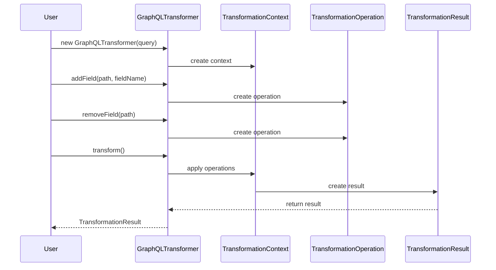

# GraphQL Query Transformation Engine

[](https://openjdk.java.net/)
[](LICENSE)
[](https://github.com/Gqlex/gqlex-path-selection-java/actions)

## 📋 Table of Contents

- [🚀 Overview](#-overview)
- [⚡ Quick Start](#-quick-start)
- [🎯 Core Features](#-core-features)
- [🔧 Usage Examples](#-usage-examples)
- [🏗️ Architecture](#️-architecture)
- [📖 API Reference](#-api-reference)
- [🎯 Best Practices](#-best-practices)
- [🆘 Support](#-support)

## 🚀 Overview

The **GraphQL Query Transformation Engine** is a powerful component of the gqlex library that enables **programmatic modification** and **dynamic manipulation** of GraphQL queries, mutations, and subscriptions. It provides a **fluent API** for transforming GraphQL documents at runtime, making your GraphQL applications more flexible and maintainable.

### Key Benefits:
- ✅ **Fluent API** - Chain multiple operations for complex transformations
- ✅ **Generic & Agnostic** - Works with any GraphQL schema
- ✅ **Field Operations** - Add, remove, rename fields dynamically
- ✅ **Argument Management** - Manipulate arguments and values
- ✅ **Alias Support** - Set and modify field aliases
- ✅ **Fragment Operations** - Handle fragments and inline fragments
- ✅ **Performance Optimized** - Efficient string-based transformations

## ⚡ Quick Start

```java
import com.intuit.gqlex.transformation.GraphQLTransformer;
import com.intuit.gqlex.transformation.TransformationResult;

// Initialize transformer with query
GraphQLTransformer transformer = new GraphQLTransformer(queryString);

// Perform transformations
TransformationResult result = transformer
    .addField("//query/hero", "id")
    .removeField("//query/hero/friends")
    .addArgument("//query/hero", "limit", 10)
    .setAlias("//query/hero", "mainHero")
    .transform();

// Get transformed query
if (result.isSuccess()) {
    String transformedQuery = result.getQueryString();
    System.out.println("Transformed query: " + transformedQuery);
} else {
    System.err.println("Transformation failed: " + result.getErrors());
}
```

## 🎯 Core Features

| Feature | Description | Example |
|---------|-------------|---------|
| **🔧 Field Operations** | Add, remove, rename fields | `.addField("//query/user", "email")` |
| **📝 Argument Management** | Add, update, remove arguments | `.addArgument("//query/user", "limit", 10)` |
| **🏷️ Alias Operations** | Set and modify field aliases | `.setAlias("//query/user", "currentUser")` |
| **🧩 Fragment Handling** | Inline and extract fragments | `.inlineAllFragments()` |
| **🔄 Query Optimization** | Sort fields and normalize arguments | `.sortFields("//query/user")` |
| **⚡ Performance** | String-based transformations | Sub-millisecond performance |

## 🔧 Usage Examples

### 1. Basic Field Operations

```java
import com.intuit.gqlex.transformation.GraphQLTransformer;
import com.intuit.gqlex.transformation.TransformationResult;

public class BasicFieldOperations {
    public static void main(String[] args) {
        String queryString = "query Hero {\n" +
            "  hero {\n" +
            "    name\n" +
            "    friends {\n" +
            "      name\n" +
            "    }\n" +
            "  }\n" +
            "}";

        GraphQLTransformer transformer = new GraphQLTransformer(queryString);

        // Add fields
        transformer.addField("//query/hero", "id");
        transformer.addField("//query/hero", "episode");

        // Remove fields
        transformer.removeField("//query/hero/friends");

        // Rename fields
        transformer.renameField("//query/hero/name", "heroName");

        TransformationResult result = transformer.transform();
        
        if (result.isSuccess()) {
            System.out.println("Transformed query:");
            System.out.println(result.getQueryString());
        }
    }
}
```

### 2. Argument Operations

```java
public class ArgumentOperations {
    public static void main(String[] args) {
        String queryString = "query Hero {\n" +
            "  hero {\n" +
            "    name\n" +
            "  }\n" +
            "}";

        GraphQLTransformer transformer = new GraphQLTransformer(queryString);

        // Add arguments
        transformer.addArgument("//query/hero", "episode", "EMPIRE");
        transformer.addArgument("//query/hero", "limit", 10);
        transformer.addArgument("//query/hero", "includeArchived", true);

        // Update existing arguments
        transformer.updateArgument("//query/hero", "episode", "JEDI");

        // Remove arguments
        transformer.removeArgument("//query/hero", "limit");

        TransformationResult result = transformer.transform();
        
        if (result.isSuccess()) {
            System.out.println("Query with arguments:");
            System.out.println(result.getQueryString());
        }
    }
}
```

### 3. Alias Management

```java
public class AliasManagement {
    public static void main(String[] args) {
        String queryString = "query Hero {\n" +
            "  hero {\n" +
            "    name\n" +
            "    friends {\n" +
            "      name\n" +
            "    }\n" +
            "  }\n" +
            "}";

        GraphQLTransformer transformer = new GraphQLTransformer(queryString);

        // Set aliases
        transformer.setAlias("//query/hero", "mainHero");
        transformer.setAlias("//query/hero/friends", "heroFriends");

        // Remove aliases
        transformer.removeAlias("//query/hero/friends");

        TransformationResult result = transformer.transform();
        
        if (result.isSuccess()) {
            System.out.println("Query with aliases:");
            System.out.println(result.getQueryString());
        }
    }
}
```

### 4. Fragment Operations

```java
public class FragmentOperations {
    public static void main(String[] args) {
        String queryString = "query Hero {\n" +
            "  hero {\n" +
            "    ...heroFields\n" +
            "    friends {\n" +
            "      ...heroFields\n" +
            "    }\n" +
            "  }\n" +
            "}\n" +
            "\n" +
            "fragment heroFields on Character {\n" +
            "  name\n" +
            "  id\n" +
            "}";

        GraphQLTransformer transformer = new GraphQLTransformer(queryString);

        // Inline all fragments
        transformer.inlineAllFragments();

        // Extract fragment from specific path
        transformer.extractFragment("//query/hero", "HeroFields", "Character");

        TransformationResult result = transformer.transform();
        
        if (result.isSuccess()) {
            System.out.println("Query with fragment operations:");
            System.out.println(result.getQueryString());
        }
    }
}
```

### 5. Complex Transformations

```java
public class ComplexTransformations {
    public static void main(String[] args) {
        String queryString = "query User($userId: ID!) {\n" +
            "  user(id: $userId) {\n" +
            "    name\n" +
            "    email\n" +
            "    profile {\n" +
            "      bio\n" +
            "      avatar\n" +
            "    }\n" +
            "    posts {\n" +
            "      title\n" +
            "      content\n" +
            "    }\n" +
            "  }\n" +
            "}";

        GraphQLTransformer transformer = new GraphQLTransformer(queryString);

        // Complex transformation chain
        TransformationResult result = transformer
            // Add new fields
            .addField("//query/user", "id")
            .addField("//query/user", "createdAt")
            .addField("//query/user/profile", "location")
            
            // Remove sensitive fields
            .removeField("//query/user/email")
            .removeField("//query/user/posts")
            
            // Add arguments
            .addArgument("//query/user", "includeArchived", false)
            .addArgument("//query/user", "limit", 100)
            
            // Set aliases
            .setAlias("//query/user", "currentUser")
            .setAlias("//query/user/profile", "userProfile")
            
            // Optimize for caching
            .sortFields("//query/user")
            .sortFields("//query/user/profile")
            .normalizeArguments("//query/user")
            
            .transform();

        if (result.isSuccess()) {
            System.out.println("Complex transformation result:");
            System.out.println(result.getQueryString());
        } else {
            System.err.println("Transformation errors:");
            result.getErrors().forEach(System.err::println);
        }
    }
}
```

### 6. Conditional Transformations

```java
public class ConditionalTransformations {
    public static void main(String[] args) {
        String queryString = "query User($userId: ID!) {\n" +
            "  user(id: $userId) {\n" +
            "    name\n" +
            "    email\n" +
            "  }\n" +
            "}";

        GraphQLTransformer transformer = new GraphQLTransformer(queryString);

        // Apply transformations based on conditions
        boolean isAdmin = checkUserPermissions();
        boolean includeSensitiveData = isAdmin;

        if (includeSensitiveData) {
            transformer.addField("//query/user", "ssn");
            transformer.addField("//query/user", "salary");
        }

        boolean includeProfile = true;
        if (includeProfile) {
            transformer.addField("//query/user", "profile");
            transformer.addField("//query/user/profile", "bio");
            transformer.addField("//query/user/profile", "avatar");
        }

        TransformationResult result = transformer.transform();
        
        if (result.isSuccess()) {
            System.out.println("Conditional transformation result:");
            System.out.println(result.getQueryString());
        }
    }

    private static boolean checkUserPermissions() {
        // Implementation for permission checking
        return false;
    }
}
```

## 🏗️ Architecture



## 📖 API Reference

### GraphQLTransformer

```java
public class GraphQLTransformer {
    // Constructor with query string
    public GraphQLTransformer(String queryString)
    
    // Field operations
    public GraphQLTransformer addField(String path, String fieldName)
    public GraphQLTransformer removeField(String path)
    public GraphQLTransformer renameField(String path, String newName)
    
    // Argument operations
    public GraphQLTransformer addArgument(String path, String name, Object value)
    public GraphQLTransformer updateArgument(String path, String name, Object value)
    public GraphQLTransformer removeArgument(String path, String name)
    
    // Alias operations
    public GraphQLTransformer setAlias(String path, String alias)
    public GraphQLTransformer removeAlias(String path)
    
    // Fragment operations
    public GraphQLTransformer inlineAllFragments()
    public GraphQLTransformer extractFragment(String path, String name, String type)
    
    // Optimization operations
    public GraphQLTransformer sortFields(String path)
    public GraphQLTransformer normalizeArguments(String path)
    
    // Execute transformations
    public TransformationResult transform()
}
```

### TransformationResult

```java
public class TransformationResult {
    // Check if transformation was successful
    public boolean isSuccess()
    
    // Get the transformed query string
    public String getQueryString()
    
    // Get transformation errors
    public List<String> getErrors()
    
    // Get transformation warnings
    public List<String> getWarnings()
    
    // Get performance metrics
    public long getTransformationTime()
}
```

### TransformationContext

```java
public class TransformationContext {
    // Get the original document
    public Document getOriginalDocument()
    
    // Get the current document state
    public Document getCurrentDocument()
    
    // Get transformation metadata
    public Map<String, Object> getMetadata()
    
    // Add metadata
    public void addMetadata(String key, Object value)
}
```

## 🎯 Best Practices

### 1. Error Handling

```java
// ✅ Good: Always check transformation results
TransformationResult result = transformer.transform();

if (result.isSuccess()) {
    String transformedQuery = result.getQueryString();
    // Use the transformed query
} else {
    // Handle errors gracefully
    System.err.println("Transformation failed:");
    result.getErrors().forEach(System.err::println);
    
    // Fallback to original query or handle error
    String fallbackQuery = originalQueryString;
}
```

### 2. Performance Optimization

```java
// ✅ Good: Reuse transformer instance for multiple operations
GraphQLTransformer transformer = new GraphQLTransformer(queryString);

// Chain operations efficiently
TransformationResult result = transformer
    .addField("//query/user", "id")
    .addField("//query/user", "name")
    .addArgument("//query/user", "limit", 10)
    .transform();

// ❌ Avoid: Creating new instances for each operation
GraphQLTransformer t1 = new GraphQLTransformer(queryString);
t1.addField("//query/user", "id");
GraphQLTransformer t2 = new GraphQLTransformer(t1.transform().getQueryString());
t2.addField("//query/user", "name");
```

### 3. Path Design

```java
// ✅ Good: Use descriptive and specific paths
transformer.addField("//query/user/profile", "bio");
transformer.addField("//query/user/posts", "title");

// ❌ Avoid: Generic or ambiguous paths
transformer.addField("//query/field1", "field2");
transformer.addField("//query/a", "b");
```

### 4. Conditional Transformations

```java
// ✅ Good: Apply transformations based on business logic
GraphQLTransformer transformer = new GraphQLTransformer(queryString);

if (user.isAdmin()) {
    transformer.addField("//query/user", "ssn");
    transformer.addField("//query/user", "salary");
}

if (includeProfile) {
    transformer.addField("//query/user", "profile");
    transformer.addField("//query/user/profile", "bio");
}

TransformationResult result = transformer.transform();
```

### 5. Validation and Testing

```java
// ✅ Good: Validate transformations
public class TransformationValidator {
    public static boolean isValidTransformation(String originalQuery, String transformedQuery) {
        try {
            // Parse both queries to ensure they're valid GraphQL
            Parser parser = new Parser();
            Document originalDoc = parser.parseDocument(originalQuery);
            Document transformedDoc = parser.parseDocument(transformedQuery);
            
            // Add custom validation logic
            return validateTransformation(originalDoc, transformedDoc);
        } catch (Exception e) {
            return false;
        }
    }
    
    private static boolean validateTransformation(Document original, Document transformed) {
        // Implement custom validation logic
        return true;
    }
}
```

### 6. Logging and Monitoring

```java
// ✅ Good: Monitor transformation performance
public class TransformationMonitor {
    private static final Logger logger = LoggerFactory.getLogger(TransformationMonitor.class);
    
    public static TransformationResult monitorTransformation(GraphQLTransformer transformer) {
        long startTime = System.currentTimeMillis();
        
        TransformationResult result = transformer.transform();
        
        long endTime = System.currentTimeMillis();
        long duration = endTime - startTime;
        
        logger.info("Transformation completed in {}ms", duration);
        
        if (!result.isSuccess()) {
            logger.error("Transformation failed with {} errors", result.getErrors().size());
        }
        
        return result;
    }
}
```

## 🆘 Support

- **📖 Documentation**: [Main README](../../../../README.md)
- **🐛 Issues**: [GitHub Issues](https://github.com/Gqlex/gqlex-path-selection-java/issues)
- **💬 Discussions**: [GitHub Discussions](https://github.com/Gqlex/gqlex-path-selection-java/discussions)
- **📧 Contact**: [Project Maintainers](https://github.com/Gqlex/gqlex-path-selection-java/blob/main/README.md#support)

---

**GraphQL Query Transformation Engine** provides powerful programmatic manipulation capabilities for GraphQL documents, enabling dynamic query modification and optimization. 🚀 