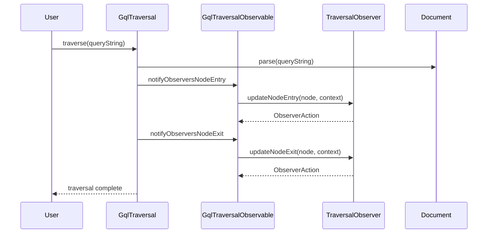

# GraphQL Traversal Engine

[](https://openjdk.java.net/)
[](LICENSE)
[](https://github.com/Gqlex/gqlex-path-selection-java/actions)

## 📋 Table of Contents

- [🚀 Overview](#-overview)
- [⚡ Quick Start](#-quick-start)
- [🎯 Core Features](#-core-features)
- [🔧 Usage Examples](#-usage-examples)
- [🏗️ Architecture](#️-architecture)
- [📖 API Reference](#-api-reference)
- [🎯 Best Practices](#-best-practices)
- [🆘 Support](#-support)

## 🚀 Overview

The **GraphQL Traversal Engine** provides comprehensive document traversal capabilities for GraphQL queries, mutations, and fragments. It uses the **Observer pattern** to enable fine-grained control over the traversal process, allowing you to inspect, analyze, and transform GraphQL documents as they are traversed.

### Key Benefits:
- ✅ **Observer Pattern** - Subscribe to traversal events
- ✅ **Complete Coverage** - Traverse all GraphQL node types
- ✅ **Context Information** - Access node relationships and metadata
- ✅ **Performance Optimized** - Configurable traversal with filtering
- ✅ **Generic & Agnostic** - Works with any GraphQL schema
- ✅ **Extensible** - Create custom observers for specific needs

## ⚡ Quick Start

```java
import com.intuit.gqlex.traversal.GqlTraversal;
import com.intuit.gqlex.traversal.TraversalObserver;
import com.intuit.gqlex.traversal.Context;
import com.intuit.gqlex.traversal.ObserverAction;

// Create traversal instance
GqlTraversal traversal = new GqlTraversal();

// Create custom observer
StringBuilderObserver observer = new StringBuilderObserver();

// Add observer to traversal
traversal.getGqlTraversalObservable().addObserver(observer);

// Traverse the document
traversal.traverse(queryString);

// Get traversal results
String result = observer.getGqlBrowsedString();
```

## 🎯 Core Features

| Feature | Description | Use Case |
|---------|-------------|----------|
| **🔍 Complete Traversal** | Visit every node in the GraphQL document | Document analysis |
| **👁️ Observer Pattern** | Subscribe to traversal events | Custom processing |
| **📊 Context Information** | Access node relationships and metadata | Node analysis |
| **⚙️ Configurable Filtering** | Skip specific node types for performance | Optimized traversal |
| **🔄 Bidirectional Events** | Node entry and exit events | Complex processing |
| **📈 Depth Tracking** | Track traversal depth | Hierarchical analysis |

## 🔧 Usage Examples

### 1. Basic Document Traversal

```java
import com.intuit.gqlex.traversal.GqlTraversal;
import com.intuit.gqlex.traversal.TraversalObserver;
import com.intuit.gqlex.traversal.Context;
import com.intuit.gqlex.traversal.ObserverAction;
import graphql.language.*;

public class BasicTraversalExample {
    public static void main(String[] args) {
        String queryString = "query Hero($episode: Episode) {\n" +
            "  hero(episode: $episode) {\n" +
            "    name\n" +
            "    friends {\n" +
            "      name\n" +
            "    }\n" +
            "  }\n" +
            "}";

        GqlTraversal traversal = new GqlTraversal();
        BasicObserver observer = new BasicObserver();
        
        traversal.getGqlTraversalObservable().addObserver(observer);
        traversal.traverse(queryString);
    }
}

class BasicObserver implements TraversalObserver {
    @Override
    public void updateNodeEntry(Node node, Node parentNode, Context context, ObserverAction observerAction) {
        System.out.println("Entering: " + context.getDocumentElementType() + 
                          " at depth: " + context.getLevel());
    }

    @Override
    public void updateNodeExit(Node node, Node parentNode, Context context, ObserverAction observerAction) {
        System.out.println("Exiting: " + context.getDocumentElementType());
    }
}
```

### 2. Field Collection Observer

```java
import java.util.ArrayList;
import java.util.List;
import graphql.language.Field;

public class FieldCollectorObserver implements TraversalObserver {
    private final List<Field> fields = new ArrayList<>();
    private final List<Integer> depths = new ArrayList<>();

    @Override
    public void updateNodeEntry(Node node, Node parentNode, Context context, ObserverAction observerAction) {
        if (context.getDocumentElementType() == DocumentElementType.FIELD) {
            fields.add((Field) node);
            depths.add(context.getLevel());
        }
    }

    @Override
    public void updateNodeExit(Node node, Node parentNode, Context context, ObserverAction observerAction) {
        // Optional: Handle exit events
    }

    public List<Field> getFields() {
        return new ArrayList<>(fields);
    }

    public List<Integer> getDepths() {
        return new ArrayList<>(depths);
    }

    public void printFields() {
        for (int i = 0; i < fields.size(); i++) {
            Field field = fields.get(i);
            int depth = depths.get(i);
            String indent = "  ".repeat(depth);
            System.out.println(indent + "Field: " + field.getName());
        }
    }
}
```

### 3. Argument Analysis Observer

```java
import java.util.HashMap;
import java.util.Map;
import graphql.language.Argument;

public class ArgumentAnalyzerObserver implements TraversalObserver {
    private final Map<String, Object> arguments = new HashMap<>();
    private final Map<String, String> argumentTypes = new HashMap<>();

    @Override
    public void updateNodeEntry(Node node, Node parentNode, Context context, ObserverAction observerAction) {
        if (context.getDocumentElementType() == DocumentElementType.ARGUMENT) {
            Argument argument = (Argument) node;
            arguments.put(argument.getName(), argument.getValue());
            
            // Determine argument type
            String type = argument.getValue().getClass().getSimpleName();
            argumentTypes.put(argument.getName(), type);
        }
    }

    @Override
    public void updateNodeExit(Node node, Node parentNode, Context context, ObserverAction observerAction) {
        // Optional: Handle exit events
    }

    public Map<String, Object> getArguments() {
        return new HashMap<>(arguments);
    }

    public Map<String, String> getArgumentTypes() {
        return new HashMap<>(argumentTypes);
    }

    public void printAnalysis() {
        System.out.println("=== Argument Analysis ===");
        arguments.forEach((name, value) -> {
            String type = argumentTypes.get(name);
            System.out.println(name + " (" + type + "): " + value);
        });
    }
}
```

### 4. Depth Analysis Observer

```java
import java.util.HashMap;
import java.util.Map;

public class DepthAnalyzerObserver implements TraversalObserver {
    private final Map<Integer, Integer> depthCounts = new HashMap<>();
    private int maxDepth = 0;

    @Override
    public void updateNodeEntry(Node node, Node parentNode, Context context, ObserverAction observerAction) {
        int depth = context.getLevel();
        depthCounts.merge(depth, 1, Integer::sum);
        maxDepth = Math.max(maxDepth, depth);
    }

    @Override
    public void updateNodeExit(Node node, Node parentNode, Context context, ObserverAction observerAction) {
        // Optional: Handle exit events
    }

    public int getMaxDepth() {
        return maxDepth;
    }

    public Map<Integer, Integer> getDepthCounts() {
        return new HashMap<>(depthCounts);
    }

    public void printDepthAnalysis() {
        System.out.println("=== Depth Analysis ===");
        System.out.println("Maximum depth: " + maxDepth);
        System.out.println("Nodes per depth:");
        depthCounts.entrySet().stream()
            .sorted(Map.Entry.comparingByKey())
            .forEach(entry -> {
                System.out.println("  Depth " + entry.getKey() + ": " + entry.getValue() + " nodes");
            });
    }
}
```

### 5. Custom String Builder Observer

```java
import java.util.ArrayList;
import java.util.List;
import java.text.MessageFormat;

public class StringBuilderObserver implements TraversalObserver {
    private final List<StringBuilderElem> elements = new ArrayList<>();
    private final boolean ignoreCollections = true;

    @Override
    public void updateNodeEntry(Node node, Node parentNode, Context context, ObserverAction observerAction) {
        String message = buildNodeMessage(node, context);
        if (message != null && !message.isEmpty()) {
            elements.add(new StringBuilderElem(message, context.getLevel()));
        }
    }

    @Override
    public void updateNodeExit(Node node, Node parentNode, Context context, ObserverAction observerAction) {
        // Optional: Handle exit events
    }

    private String buildNodeMessage(Node node, Context context) {
        DocumentElementType type = context.getDocumentElementType();
        
        switch (type) {
            case DOCUMENT:
                return MessageFormat.format("Node: {0} || Type: {1}", "Document", type.name());
                
            case FIELD:
                Field field = (Field) node;
                return MessageFormat.format("Name: {0} || Alias: {1} || Type: {2}",
                    field.getName(), field.getAlias(), type.name());
                    
            case ARGUMENT:
                Argument argument = (Argument) node;
                return MessageFormat.format("Name: {0} || Value: {1} || Type: {2}",
                    argument.getName(), argument.getValue(), type.name());
                    
            case DIRECTIVE:
                Directive directive = (Directive) node;
                return MessageFormat.format("Name: {0} || Type: {1}", 
                    directive.getName(), type.name());
                    
            case OPERATION_DEFINITION:
                OperationDefinition op = (OperationDefinition) node;
                return MessageFormat.format("Name: {0} || Type: {1}",
                    op.getOperation().toString(), type.name());
                    
            case FRAGMENT_DEFINITION:
                FragmentDefinition frag = (FragmentDefinition) node;
                return MessageFormat.format("Name: {0} || Type: {1}",
                    frag.getName(), type.name());
                    
            case VARIABLE_DEFINITION:
                VariableDefinition var = (VariableDefinition) node;
                return MessageFormat.format("Name: {0} || Default: {1} || Type: {2}",
                    var.getName(), var.getDefaultValue(), type.name());
                    
            default:
                if (ignoreCollections && isCollectionType(type)) {
                    return null;
                }
                return MessageFormat.format("Node: {0} || Type: {1}", 
                    type.name().toLowerCase(), type.name());
        }
    }

    private boolean isCollectionType(DocumentElementType type) {
        return type == DocumentElementType.ARGUMENTS ||
               type == DocumentElementType.SELECTION_SET ||
               type == DocumentElementType.VARIABLE_DEFINITIONS ||
               type == DocumentElementType.DIRECTIVES ||
               type == DocumentElementType.DEFINITIONS;
    }

    public String getFormattedString() {
        return getStringAs(true);
    }

    public String getCompactString() {
        return getStringAs(false);
    }

    private String getStringAs(boolean indent) {
        StringBuilder result = new StringBuilder();
        for (int i = 0; i < elements.size(); i++) {
            StringBuilderElem elem = elements.get(i);
            if (indent) {
                String spaces = "  ".repeat(elem.getDepth());
                result.append(spaces).append(elem.getName()).append("\n");
            } else {
                result.append(elem.getName());
                if (i < elements.size() - 1) {
                    result.append(" ");
                }
            }
        }
        return result.toString();
    }

    private static class StringBuilderElem {
        private final String name;
        private final int depth;

        public StringBuilderElem(String name, int depth) {
            this.name = name;
            this.depth = depth;
        }

        public String getName() { return name; }
        public int getDepth() { return depth; }
    }
}
```

## 🏗️ Architecture



## 📖 API Reference

### GqlTraversal

```java
public class GqlTraversal {
    // Traverse a GraphQL document string
    public void traverse(String queryString)
    
    // Traverse a parsed Document
    public void traverse(Document document)
    
    // Get the observable for adding observers
    public GqlTraversalObservable getGqlTraversalObservable()
}
```

### TraversalObserver

```java
public interface TraversalObserver {
    // Called when entering a node
    void updateNodeEntry(Node node, Node parentNode, Context context, ObserverAction observerAction)
    
    // Called when exiting a node
    void updateNodeExit(Node node, Node parentNode, Context context, ObserverAction observerAction)
}
```

### Context

```java
public class Context {
    // Get the current node's element type
    public DocumentElementType getDocumentElementType()
    
    // Get the traversal depth
    public int getLevel()
    
    // Get the node stack (path to current node)
    public Stack<Node> getStack()
    
    // Get parent node
    public Node getParentNode()
}
```

### ObserverAction

```java
public enum ObserverAction {
    CONTINUE,    // Continue normal traversal
    SKIP_CHILDREN, // Skip children of current node
    STOP         // Stop traversal completely
}
```

## 🎯 Best Practices

### 1. Observer Design

```java
// ✅ Good: Single responsibility observers
public class FieldCollectorObserver implements TraversalObserver {
    // Only collect fields
}

public class ArgumentAnalyzerObserver implements TraversalObserver {
    // Only analyze arguments
}

// ❌ Avoid: Multi-purpose observers
public class EverythingObserver implements TraversalObserver {
    // Does too many things
}
```

### 2. Performance Optimization

```java
// ✅ Good: Use ObserverAction to optimize traversal
@Override
public void updateNodeEntry(Node node, Node parentNode, Context context, ObserverAction observerAction) {
    if (context.getDocumentElementType() == DocumentElementType.FIELD) {
        // Process field
        observerAction.setAction(ObserverAction.CONTINUE);
    } else {
        // Skip non-field nodes for performance
        observerAction.setAction(ObserverAction.SKIP_CHILDREN);
    }
}
```

### 3. Error Handling

```java
// ✅ Good: Handle traversal errors gracefully
try {
    GqlTraversal traversal = new GqlTraversal();
    MyObserver observer = new MyObserver();
    traversal.getGqlTraversalObservable().addObserver(observer);
    traversal.traverse(queryString);
} catch (Exception e) {
    // Handle parsing or traversal errors
    System.err.println("Traversal error: " + e.getMessage());
}
```

### 4. Context Usage

```java
// ✅ Good: Use context information effectively
@Override
public void updateNodeEntry(Node node, Node parentNode, Context context, ObserverAction observerAction) {
    // Use depth for indentation
    int depth = context.getLevel();
    String indent = "  ".repeat(depth);
    
    // Use element type for filtering
    DocumentElementType type = context.getDocumentElementType();
    if (type == DocumentElementType.FIELD) {
        // Process only fields
    }
    
    // Use stack for path information
    Stack<Node> stack = context.getStack();
    // Analyze path to current node
}
```

### 5. Observer Reusability

```java
// ✅ Good: Make observers reusable
public class ConfigurableFieldObserver implements TraversalObserver {
    private final Set<String> fieldNames;
    private final List<Field> collectedFields = new ArrayList<>();
    
    public ConfigurableFieldObserver(Set<String> fieldNames) {
        this.fieldNames = new HashSet<>(fieldNames);
    }
    
    @Override
    public void updateNodeEntry(Node node, Node parentNode, Context context, ObserverAction observerAction) {
        if (context.getDocumentElementType() == DocumentElementType.FIELD) {
            Field field = (Field) node;
            if (fieldNames.contains(field.getName())) {
                collectedFields.add(field);
            }
        }
    }
    
    public List<Field> getCollectedFields() {
        return new ArrayList<>(collectedFields);
    }
}
```

## 🆘 Support

- **📖 Documentation**: [Main README](../../../../README.md)
- **🐛 Issues**: [GitHub Issues](https://github.com/Gqlex/gqlex-path-selection-java/issues)
- **💬 Discussions**: [GitHub Discussions](https://github.com/Gqlex/gqlex-path-selection-java/discussions)
- **📧 Contact**: [Project Maintainers](https://github.com/Gqlex/gqlex-path-selection-java/blob/main/README.md#support)

---

**GraphQL Traversal Engine** provides powerful document traversal capabilities with fine-grained control through the observer pattern, enabling comprehensive analysis and processing of GraphQL documents. 🚀
